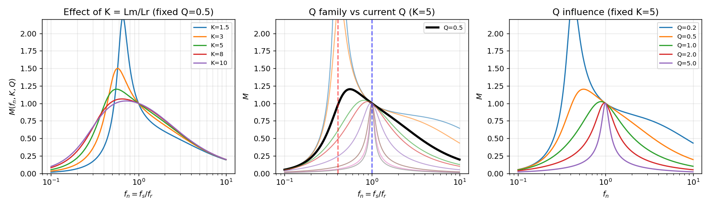

<div align="center">

# LLC 谐振变换器增益曲线可视化工具

**Interactive FHA Gain-Curve Visualizer for LLC Resonant Converters**

简体中文 | [English](README_EN.md)

[](https://github.com/nobodycareme/LLC-Gain-Curve-Visualizer/releases/latest)
[](#快速下载)
[](requirements.txt)
[](requirements.txt)
[](LICENSE)
[](#测试与验证)
[](https://github.com/nobodycareme/LLC-Gain-Curve-Visualizer/actions/workflows/tests.yml)
[](#)

一个用于研究 LLC 谐振变换器 **FHA（基波近似）增益特性** 的交互式 Windows 桌面工具，
面向电力电子专业学生、开关电源工程师以及 LLC 参数设计与教学活动。

</div>

---

## 目录

- [项目简介](#1-项目简介)
- [界面预览](#2-界面预览)
- [核心功能](#3-核心功能)
- [数学模型](#4-数学模型)
- [参数影响](#5-参数影响)
- [快速下载](#6-快速下载)
- [使用方法](#7-使用方法)
- [SHA-256 验证](#8-sha-256-验证)
- [Windows 安全提示](#9-windows-安全提示)
- [从源码运行](#10-从源码运行)
- [重新构建 EXE](#11-重新构建-exe)
- [测试与验证](#12-测试与验证)
- [技术架构](#13-技术架构)
- [适用范围与局限性](#14-适用范围与局限性)
- [项目结构](#15-项目结构)
- [引用方式](#16-引用方式)
- [贡献指南](#17-贡献指南)
- [License](#18-license)
- [致谢](#19-致谢)

---

## 1. 项目简介

本项目是一个用于研究 LLC 谐振变换器 FHA（基波近似, First Harmonic Approximation）
电压增益特性的交互式 Windows 桌面工具。它基于经典 LLC 基波分析方法，
将增益 `M(fn, K, Q)` 表示为归一化频率、电感比与品质因数的函数，
并通过实时可调滑块与对数坐标绘制的多曲线族，直观呈现参数变化对增益特性与谐振点的影响。

**适用对象：**

- 电力电子专业学生；
- 开关电源工程师；
- LLC 参数设计与教学；
- 面试与课程学习；
- 初步参数敏感性分析。

## 2. 界面预览

程序主界面（真实运行截图）：


K、Q、fn 共同影响增益曲线族（基于真实数学模型渲染）：



## 3. 核心功能

- 多条固定参考 Q 曲线（Q = 0.1, 0.2, 0.5, 0.8, 1.0, 2.0, 5.0, 8.0, 10.0）；
- 当前 Q 曲线突出显示（黑色粗线）；
- K = Lm/Lr 实时调节（线性滑块，1.5 ~ 10）；
- Q 实时调节（对数滑块，0.05 ~ 10）；
- 工作点 fn = fs/fr 实时调节（对数滑块，0.1 ~ 10）；
- 并联谐振点 fnp 与串联谐振点 fnr = 1 标记；
- 当前增益峰值搜索；
- 实际频率换算（fs = fn · fr）；
- 中文桌面界面；
- 对数频率坐标；
- Windows 单文件 EXE（无 Python 环境也可运行）。

## 4. 数学模型

符号体系（统一采用，全程保持一致）：

| 符号 | 定义 | 物理意义 |
|------|------|----------|
| `K` | `Lm / Lr` | 励磁电感比（无单位） |
| `fn` | `fs / fr` | 归一化开关频率（无单位） |
| `Q` | `sqrt(Lr / Cr) / Rac` | 品质因数（负载因子） |
| `fr` | `1 / (2π√(Lr·Cr))` | 串联谐振频率（Hz） |
| `fp` | `1 / (2π√((Lr + Lm)·Cr))` | 并联谐振频率（Hz） |
| `M(fn, K, Q)` | 增益 | FHA 电压增益（无量纲） |

**FHA 增益公式：**

```
         K · fn²
M = ---------------------
    sqrt( ((1+K)·fn² − 1)² + (Q·K·fn·(fn² − 1))² )
```

**谐振点（归一化频率）：**

```
并联谐振：fnp = fp/fr = 1 / sqrt(1 + K)
串联谐振：fnr = fr/fr = 1
```

**实际频率换算：**

```
fs    = fn      · fr
fp    = fnp     · fr
fpeak = fn_peak · fr
```

其中 `fn_peak` 为曲线增益峰值对应的归一化频率（通过数值搜索得到，通过高精度方式获得）。

符号含义强调：`K` 是电感比（`Lm/Lr`），`fn` 是归一化频率（`fs/fr`），`Q` 是品质因数。
`fnp` 是并联谐振对应的归一化频率；`fnr = 1` 是串联谐振对应的归一化频率。

## 5. 参数影响

- 修改 `K`：改变电感比，影响 **全部**增益曲线族（整族曲线同时重算）；
- 修改 `Q`：改变当前负载条件，只有 **当前 Q 曲线** 变化（固定参考曲线族不变）；
- 修改 `fn`：改变工作点，工作点沿当前 Q 曲线移动（不重算任何曲线）；
- 修改 `fr`：只改变实际频率换算（`fs = fn · fr`），不改变归一化增益曲线形状。

（具体影响幅度依赖其他参数的取值，以上为趋势性描述，模拟计算结果为准。）

## 6. 快速下载

最新正式版：**v1.0.0**

点击下载（下载源为 GitHub Releases，EXE 不在 Git 仓库中）：

[](https://github.com/nobodycareme/LLC-Gain-Curve-Visualizer/releases/latest)

资产名称：`LLC-Gain-Curve-Visualizer-v1.0.0-Windows-x64.exe`

## 7. 使用方法

1. 从 [Releases](https://github.com/nobodycareme/LLC-Gain-Curve-Visualizer/releases/latest) 下载 EXE；
2. 验证 SHA-256（见下一节）；
3. 双击运行；
4. 调节 K、Q、fn 滑块；
5. 修改 fr 和纵轴范围；
6. 观察曲线变化、谐振点与增益峰值。

## 8. SHA-256 验证

在 PowerShell 中执行：

```powershell
Get-FileHash ".\LLC-Gain-Curve-Visualizer-v1.0.0-Windows-x64.exe" -Algorithm SHA256
```

本项目 v1.0.0 官方发布的 SHA-256：

```
04DB3032D0820783EA1AE212C2D7BCDD7C259995439856E882597BB82A3398BB
```

也可直接比对 Release 附件 `SHA256SUMS.txt` 中的记录。

## 9. Windows 安全提示

- 当前 EXE 未经代码签名，Windows SmartScreen 可能显示"未知发布者"提示；
- 请始终从本仓库 **官方 Releases 页面** 下载 EXE，不要使用第三方镜像；
- 任何版本都可用上一节提供的方式（SHA-256）校验文件完整性；
- 不要再教用户关闭或禁用杀毒软件；若杀毒软件报警，请以实际文件哈希核实来源后可自行判断，
  并在 Issue 中反馈。

## 10. 从源码运行

```powershell
python -m venv .venv
.\.venv\Scripts\activate
python -m pip install -r requirements.txt
python src\main.py
```

也可以直接运行 `scripts\run_source.bat`（脚本会自动创建虚拟环境并启动程序）。

## 11. 重新构建 EXE

使用 `scripts\build_exe.bat` 可以一键完成：创建虚拟环境 → 安装依赖 → 运行
测试（测试失败即停止）→ 构建并验证 onedir 版本 → 构建 onefile 单文件 EXE
→ 启动/退出/再启动自动验证 → 输出路径、大小与 SHA-256。

```bat
scripts\build_exe.bat
```

## 12. 测试与验证

本项目使用 **pytest** 进行单元测试与 GUI 冒烟测试，共 **317** 项测试：

| 测试文件 | 用例数 | 覆盖内容 |
|----------|--------|----------|
| `tests/test_llc_model.py` | 233 | 数学模型（增益公式、谐振点、峰值、换算） |
| `tests/test_llc_plot.py` | 31 | 绘图层（对象复用、数据更新正确性） |
| `tests/test_gui_smoke.py` | 25 | GUI 冒烟（窗口、参数交互、重入保护） |
| `tests/test_perf_fix.py` | 20 | 性能（增量刷新、事件合并） |
| `tests/test_cjk_font.py` | 8 | 中文字体自动探测 |

本地（Windows 10/11 64 位，Python 3.10.11，在 `.venv` 中）实际运行结果：

```
317 passed in 35.11s
```

覆盖内容包括：

- 数学模型：增益公式、谐振点、峰值搜索、单位换算等；
- 绘图层：Matplotlib 对象复用、数据更新正确性；
- 字体配置：中文字体自动探测；
- GUI 冒烟：窗口构建、参数调节、图形对象数量回归、重入保护等；
- 性能修复：异步刷新合并、K/Q/fn 依赖的增量计算。

> 提示：GUI 冒烟测试使用 `QT_QPA_PLATFORM=offscreen`，可在无图形桌面环境
> 下运行（当前在 Windows 桌面环境已验证通过）。

## 13. 技术架构

| 组件 | 用途 |
|------|------|
| Python | 编程语言 |
| NumPy | 数值计算 |
| Matplotlib | 绘图与图形渲染 |
| PySide6 / Qt | 桌面 GUI 框架 |
| pytest | 自动化测试 |
| PyInstaller | 构建单文件 EXE |

数据流模型：


## 14. 适用范围与局限性

- 本工具基于 **FHA 基波近似**，适用于参数趋势分析和教学；
- **不能替代** 开关级时域仿真；
- **不能替代** 器件应力分析、ZVS 范围验证、磁件损耗计算与闭环稳定性验证；
- 实际设计仍需结合仿真与硬件测试；
- 当前发布目标为 Windows 10 / 11 64 位。

## 15. 项目结构

```
LLC-Gain-Curve-Visualizer/
├─ src/
│  ├─ main.py          PySide6 主窗口与交互逻辑
│  ├─ llc_model.py     数学模型（K、fn、Q、M、谐振点等）
│  ├─ llc_plot.py      Matplotlib 绘图层
│  └─ cjk_font.py      中文字体自动检测
├─ tests/              测试用例（317 个）
│  ├─ test_llc_model.py
│  ├─ test_llc_plot.py
│  ├─ test_cjk_font.py
│  ├─ test_gui_smoke.py
│  └─ test_perf_fix.py
├─ scripts/
│  ├─ build_exe.bat
│  ├─ run_source.bat
│  ├─ build_debug_console.bat
│  └─ fetch_offline_wheels.bat
├─ docs/
│  ├─ images/              界面截图与参数分析图
│  ├─ BUILD_AND_VALIDATION.md
│  └─ release-notes-v1.0.0.md
├─ .github/
│  ├─ ISSUE_TEMPLATE/
│  └─ workflows/
├─ requirements.txt
├─ LICENSE
├─ CITATION.cff
├─ CHANGELOG.md
├─ CONTRIBUTING.md
└─ SECURITY.md
```

## 16. 引用方式

```bibtex
@misc{gaincurve2026,
  title  = {LLC Gain Curve Visualizer},
  author = {nobodycareme},
  year   = {2026},
  url    = {https://github.com/nobodycareme/LLC-Gain-Curve-Visualizer},
}
```

详见 [CITATION.cff](CITATION.cff)。

## 17. 贡献指南

欢迎报告问题与提交代码贡献。请先阅读 [CONTRIBUTING.md](CONTRIBUTING.md)，
其中包含环境配置、测试运行与 Pull Request 提交的指引。

## 18. License

本项目使用 [MIT License](LICENSE)。

## 19. 致谢

- [NumPy](https://numpy.org/) — MIT License
- [Matplotlib](https://matplotlib.org/) — Matplotlib License
- [Qt for Python (PySide6)](https://doc.qt.io/qtforpython/) — LGPLv3
- [PyInstaller](https://pyinstaller.org/) — GPLv2 (with exceptions)

具体第三方组件与许可证细节见 [THIRD_PARTY_NOTICES.md](THIRD_PARTY_NOTICES.md)。