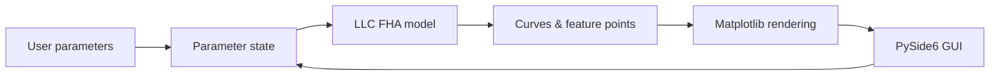

<div align="center">

# LLC Resonant Converter Gain-Curve Visualizer

**Interactive FHA Gain-Curve Visualizer for LLC Resonant Converters**

[简体中文](README.md) | English

[](https://github.com/nobodycareme/LLC-Gain-Curve-Visualizer/releases/latest)
[](#quick-download)
[](requirements.txt)
[](requirements.txt)
[](LICENSE)
[](#tests-and-validation)
[](https://github.com/nobodycareme/LLC-Gain-Curve-Visualizer/actions/workflows/tests.yml)
[](#)

An interactive Windows desktop tool for studying the **FHA (First Harmonic Approximation)
gain characteristics** of LLC resonant converters — built for power-electronics students,
power-supply engineers, and LLC parameter design and teaching.

</div>

---

## Table of Contents

- [Introduction](#1-introduction)
- [Screenshots](#2-screenshots)
- [Features](#3-features)
- [Mathematical Model](#4-mathematical-model)
- [Parameter Effects](#5-parameter-effects)
- [Quick Download](#6-quick-download)
- [Usage](#7-usage)
- [SHA-256 Verification](#8-sha-256-verification)
- [Windows Security Notice](#9-windows-security-notice)
- [Run from Source](#10-run-from-source)
- [Rebuild the EXE](#11-rebuild-the-exe)
- [Tests and Validation](#12-tests-and-validation)
- [Technical Architecture](#13-technical-architecture)
- [Scope and Limitations](#14-scope-and-limitations)
- [Project Structure](#15-project-structure)
- [Citation](#16-citation)
- [Contributing](#17-contributing)
- [License](#18-license)
- [Acknowledgements](#19-acknowledgements)

---

## 1. Introduction

This project is an interactive Windows desktop application for exploring the FHA
(First Harmonic Approximation) voltage-gain characteristics of LLC resonant converters.
It expresses the gain `M(fn, K, Q)` as a function of normalized frequency, inductance
ratio, and quality factor, and visualizes the gain family with a logarithmic frequency
axis and real-time adjustable sliders.

**Target audience:**

- Power-electronics students;
- Power-supply (SMPS) engineers;
- LLC parameter design and teaching;
- Interview preparation and coursework;
- Preliminary parameter sensitivity analysis.

## 2. Screenshots

Main interface (real capture of the running application):


The K, Q, fn family of gain curves (rendered from the real mathematical model):


## 3. Features

- Multiple fixed reference-Q curves (Q = 0.1, 0.2, 0.5, 0.8, 1.0, 2.0, 5.0, 8.0, 10.0);
- Current-Q curve highlighted as a bold black line;
- Real-time K = Lm/Lr adjustment (linear slider, 1.5 ~ 10);
- Real-time Q adjustment (log slider, 0.05 ~ 10);
- Real-time operating-point fn = fs/fr adjustment (log slider, 0.1 ~ 10);
- Parallel-resonance point fnp and series-resonance point fnr = 1 markers;
- Current gain-peak search;
- Real-frequency conversion (fs = fn · fr);
- Chinese desktop UI;
- Logarithmic frequency axis;
- Single-file Windows EXE (no Python needed).

## 4. Mathematical Model

Notation (used consistently throughout the project):

| Symbol | Definition | Physical meaning |
|--------|------------|------------------|
| `K` | `Lm / Lr` | magnetizing-inductance ratio (dimensionless) |
| `fn` | `fs / fr` | normalized switching frequency (dimensionless) |
| `Q` | `sqrt(Lr / Cr) / Rac` | quality factor (load factor) |
| `fr` | `1 / (2π√(Lr·Cr))` | series-resonance frequency (Hz) |
| `fp` | `1 / (2π√((Lr + Lm)·Cr))` | parallel-resonance frequency (Hz) |
| `M(fn, K, Q)` | gain | FHA voltage gain (dimensionless) |

**FHA gain formula:**

```
         K · fn²
M = ---------------------
    sqrt( ((1+K)·fn² − 1)² + (Q·K·fn·(fn² − 1))² )
```

**Resonance points (normalized frequency):**

```
Parallel resonance:  fnp = fp/fr = 1 / sqrt(1 + K)
Series resonance:    fnr = fr/fr = 1
```

**Real-frequency conversion:**

```
fs    = fn      · fr
fp    = fnp     · fr
fpeak = fn_peak · fr
```

where `fn_peak` is the normalized frequency of the gain peak, obtained by numerical
search over the current curve.

Note: `K` is the inductance ratio (`Lm/Lr`), `fn` is the normalized frequency (`fs/fr`),
`Q` is the quality factor. `fnp` and `fnr = 1` are the normalized frequencies of the
parallel and series resonance points respectively; neither should be confused with the
gain-peak location `fn_peak`.

## 5. Parameter Effects

- Changing `K` modifies the inductance ratio and affects **all** gain curves (the whole
  family is recomputed);
- Changing `Q` modifies the current load condition; only the **current-Q curve** changes
  (the fixed reference family is unchanged);
- Changing `fn` moves the operating point along the current-Q curve (no curve is recomputed);
- Changing `fr` only affects the real-frequency conversion (`fs = fn · fr`) and does not
  change the normalized gain-curve shape.

(The magnitude of each effect depends on the other parameters; the above are trends —
always confirm with the computed results.)

## 6. Quick Download

Latest stable release: **v1.0.0**

[](https://github.com/nobodycareme/LLC-Gain-Curve-Visualizer/releases/latest)

Asset name: `LLC-Gain-Curve-Visualizer-v1.0.0-Windows-x64.exe`

## 7. Usage

1. Download the EXE from the [Releases](https://github.com/nobodycareme/LLC-Gain-Curve-Visualizer/releases/latest) page;
2. Verify the SHA-256 (see next section);
3. Double-click to run;
4. Adjust the K, Q, fn sliders;
5. Modify fr and the y-axis limit;
6. Observe the curves, resonance points, and the gain peak.

## 8. SHA-256 Verification

Run in PowerShell:

```powershell
Get-FileHash ".\LLC-Gain-Curve-Visualizer-v1.0.0-Windows-x64.exe" -Algorithm SHA256
```

Official SHA-256 for v1.0.0:

```
04DB3032D0820783EA1AE212C2D7BCDD7C259995439856E882597BB82A3398BB
```

The same value is recorded in the `SHA256SUMS.txt` asset of the release.

## 9. Windows Security Notice

- The current EXE is not code-signed; Windows SmartScreen may show an "Unknown publisher"
  prompt;
- Always download from the **official Releases page** of this repository — never from
  third-party mirrors;
- You can verify file integrity with the SHA-256 value in section 8;
- Do not disable your antivirus software; if it flags the file, verify the hash against
  the official value, and report the case in an Issue.

## 10. Run from Source

```powershell
python -m venv .venv
.\.venv\Scripts\activate
python -m pip install -r requirements.txt
python src\main.py
```

Alternatively, run `scripts\run_source.bat` (it creates the virtual environment and
starts the program automatically).

## 11. Rebuild the EXE

`scripts\build_exe.bat` performs the full pipeline: create the virtual environment →
install dependencies → run tests (build stops on failure) → build and validate the
onedir build → build the single-file EXE → auto-launch/exit/relaunch validation →
print path, size, and SHA-256.

```bat
scripts\build_exe.bat
```

## 12. Tests and Validation

The project uses **pytest** for unit tests and GUI smoke tests — **317 tests** in total:

| Test file | Cases | Coverage |
|-----------|-------|----------|
| `tests/test_llc_model.py` | 233 | mathematical model (gain formula, resonance points, peak, conversion) |
| `tests/test_llc_plot.py` | 31 | plotting layer (object reuse, data-update correctness) |
| `tests/test_gui_smoke.py` | 25 | GUI smoke (window, parameter interaction, reentrancy) |
| `tests/test_perf_fix.py` | 20 | performance (incremental refresh, event coalescing) |
| `tests/test_cjk_font.py` | 8 | CJK font auto-detection |

Actual local result (Windows 10/11 x64, Python 3.10.11, inside `.venv`):

```
317 passed in 35.11s
```

Coverage includes:

- Mathematical model: gain formula, resonance points, peak search, unit conversion;
- Plot layer: Matplotlib object reuse and data-update correctness;
- Font configuration: CJK font auto-detection;
- GUI smoke: window construction, parameter changes, artist-count regression,
  reentrancy protection;
- Performance fixes: coalesced refresh, incremental computation for K/Q/fn.

> Note: GUI smoke tests run with `QT_QPA_PLATFORM=offscreen` and can execute without a
> graphical desktop (verified on a Windows desktop environment).

## 13. Technical Architecture

| Component | Purpose |
|-----------|---------|
| Python | programming language |
| NumPy | numerical computation |
| Matplotlib | plotting and rendering |
| PySide6 / Qt | desktop GUI framework |
| pytest | automated testing |
| PyInstaller | single-file EXE build |

Data-flow model:



## 14. Scope and Limitations

- The tool is based on the **FHA (First Harmonic Approximation)** and is intended for
  parameter-trend analysis and teaching;
- It is **not a substitute** for switch-level time-domain simulation;
- It is **not a substitute** for device-stress analysis, ZVS-range verification,
  magnetic-loss estimation, or closed-loop stability validation;
- Practical designs must still combine simulation and hardware testing;
- The current release targets Windows 10 / 11 64-bit.

## 15. Project Structure

```
LLC-Gain-Curve-Visualizer/
├─ src/
│  ├─ main.py          PySide6 main window and interaction logic
│  ├─ llc_model.py     mathematical model (K, fn, Q, M, resonance points)
│  ├─ llc_plot.py      Matplotlib plotting layer
│  └─ cjk_font.py      CJK font auto-detection
├─ tests/              317 tests
│  ├─ test_llc_model.py
│  ├─ test_llc_plot.py
│  ├─ test_cjk_font.py
│  ├─ test_gui_smoke.py
│  └─ test_perf_fix.py
├─ scripts/
│  ├─ build_exe.bat
│  ├─ run_source.bat
│  ├─ build_debug_console.bat
│  └─ fetch_offline_wheels.bat
├─ docs/
│  ├─ images/              screenshots and analysis figures
│  ├─ BUILD_AND_VALIDATION.md
│  └─ release-notes-v1.0.0.md
├─ .github/
│  ├─ ISSUE_TEMPLATE/
│  └─ workflows/
├─ requirements.txt
├─ LICENSE
├─ CITATION.cff
├─ CHANGELOG.md
├─ CONTRIBUTING.md
└─ SECURITY.md
```

## 16. Citation

```bibtex
@misc{gaincurve2026,
  title  = {LLC Gain Curve Visualizer},
  author = {nobodycareme},
  year   = {2026},
  url    = {https://github.com/nobodycareme/LLC-Gain-Curve-Visualizer},
}
```

See also [CITATION.cff](CITATION.cff).

## 17. Contributing

Issues and pull requests are welcome. Please read [CONTRIBUTING.md](CONTRIBUTING.md)
first — it covers environment setup, running tests, and the PR process.

## 18. License

This project is licensed under the [MIT License](LICENSE).

## 19. Acknowledgements

- [NumPy](https://numpy.org/) — MIT License
- [Matplotlib](https://matplotlib.org/) — Matplotlib License
- [Qt for Python (PySide6)](https://doc.qt.io/qtforpython/) — LGPLv3
- [PyInstaller](https://pyinstaller.org/) — GPLv2 (with exceptions)

See [THIRD_PARTY_NOTICES.md](THIRD_PARTY_NOTICES.md) for third-party license details.