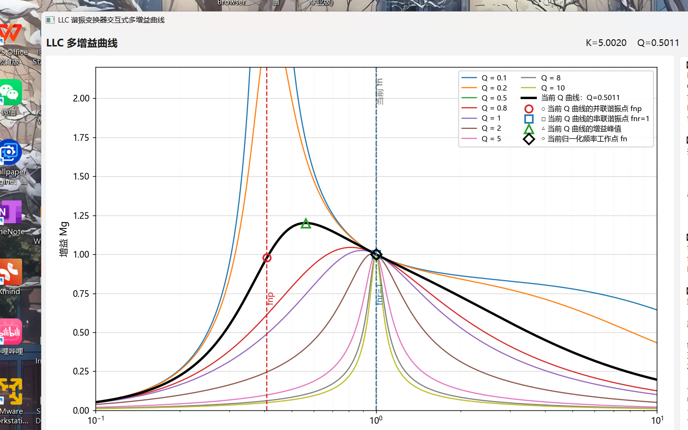

<div align="center">

# LLC Resonant Converter Gain-Curve Visualizer

**LLC FHA Gain-Curve Visualizer — Interactive FHA Gain-Curve Analysis + Engineering Design Aids**

[简体中文](README.md) | English

[](https://github.com/nobodycareme/LLC-Gain-Curve-Visualizer/releases/latest)
[](#quick-download)
[](requirements.txt)
[](requirements.txt)
[](LICENSE)
[](#tests-and-validation)
[](https://github.com/nobodycareme/LLC-Gain-Curve-Visualizer/actions/workflows/tests.yml)
[](#)

An interactive Windows desktop tool **centered on LLC FHA multi gain-curve analysis**,
with engineering parameter design aids and FHA current/stress estimation — built for
power-electronics students, power-supply engineers, and LLC parameter design and teaching.

</div>

---

## 1. Introduction

This project is an interactive Windows desktop application for exploring the FHA
(First Harmonic Approximation) voltage-gain characteristics of LLC resonant converters.
It expresses the gain `M(fn, K, Q)` as a function of normalized frequency, inductance
ratio, and quality factor, and visualizes the gain family with a logarithmic frequency
axis and real-time adjustable sliders — showing how parameters affect the gain curves,
the resonance points, and the inductive/capacitive operating regions.

On top of the curve analysis, it provides **engineering parameter design aids**
(input/output specifications, topology, rectifier, turns ratio, efficiency, etc.),
**frequency-modulation-range derivation**, and **FHA current/stress estimation**.

**Software positioning:**

> A Windows desktop tool **centered on LLC FHA gain-curve analysis**, with engineering
> parameter design aids and stress estimation. The engineering and stress features are
> **auxiliary design capabilities** — the core stays gain-curve analysis, for parameter
> trend studies, early-stage design, and teaching. It is **not** a full commercial-grade
> automatic power-supply design tool, and it does not replace switch-level time-domain
> simulation or hardware verification.

**Target audience:**

- Power-electronics students;
- Power-supply (SMPS) engineers;
- LLC parameter design and teaching;
- Interview preparation and coursework;
- Preliminary parameter sensitivity analysis.

## 2. Screenshots

Main interface (v2.0.0 actual Windows rendering — with engineering design aids, a
collapsible result sidebar, and complete curve information):



## 3. Features

### Gain-curve analysis

- Real-time K = Lm/Lr adjustment (slider + numeric input);
- Q slider + numeric input;
- Real-time operating-point fn = fs/fr;
- Multiple reference-Q curves show/hide;
- Current-Q curve highlighted as a bold black line;
- Parallel-resonance point fnp and series-resonance point fnr = 1 markers;
- Gain peak and current operating-point markers;
- **Exact RC boundary** (based on `Im(Zin) = 0`), inductive/capacitive region detection;
- **Curve Hover Inspector**: hover any curve to see exact parameters of that point;
- Required-gain range Mmin~Mmax display;
- Frequency-modulation range fnmin~fnmax display;
- Logarithmic frequency axis with complete major ticks (0.1 / 0.2 / 0.5 / 1 / 2 / 5 / 10);
- High-DPI support.

### Engineering design aids (collapsed by default; curve-first UI)

Inputs:

- Vin_min / Vin_nom / Vin_max;
- Vo;
- Pout / Io;
- Topology: half-bridge / full-bridge;
- Rectifier: center-tap / full-bridge × diode / synchronous;
- Auto / manual turns ratio;
- η;
- Vf;
- Overload ratio;
- Manual / recommended Q.

### Automatic computation

- n;
- RL, Re, Zr;
- Lr, Lm, Cr;
- M_req_min, M_req_max;
- Q_full, Q_overload;
- fn_min, fn_max, fs_min, fs_max.

### FHA current & stress estimation

- Ioe, Im, Ir;
- Cr RMS current, Cr peak voltage;
- Related FHA estimates.

### UI

- Engineering parameters collapsed by default; curve-first;
- Collapsible/restorable result sidebar;
- Display-options popup;
- Modern Chinese UI (Windows 10 / 11 look);
- Windows 10 / 11 x64;
- Single-file EXE, no Python installation required.

## 4. Mathematical Model

Notation (used consistently throughout the project):

| Symbol | Definition | Physical meaning |
|--------|------------|------------------|
| `K` | `Lm / Lr` | magnetizing-inductance ratio (dimensionless) |
| `fn` | `fs / fr` | normalized switching frequency (dimensionless) |
| `Q` | `sqrt(Lr / Cr) / Rac` | quality factor (load factor) |
| `fr` | `1 / (2π√(Lr·Cr))` | series-resonance frequency (Hz) |
| `fp` | `1 / (2π√((Lr + Lm)·Cr))` | parallel-resonance frequency (Hz) |
| `M(fn, K, Q)` | gain | FHA voltage gain (dimensionless) |

**FHA gain formula:**

```
         K · fn²
M = ---------------------
    sqrt( ((1+K)·fn² − 1)² + (Q·K·fn·(fn² − 1))² )
```

**Resonance points (normalized frequency):**

```
Parallel resonance:  fnp = fp/fr = 1 / sqrt(1 + K)
Series resonance:    fnr = fr/fr = 1
```

**Real-frequency conversion:**

```
fs    = fn      · fr
fp    = fnp     · fr
fpeak = fn_peak · fr
```

where `fn_peak` is the normalized frequency of the gain peak, obtained by numerical
search over the current curve.

> **Important**: this project consistently uses `K = Lm/Lr`, `fn = fs/fr`, and
> `Q = sqrt(Lr/Cr)/Rac`. Curves obtained with other K/Q conventions in the literature
> will differ — do not confuse the definitions when using this tool.

## 5. Exact RC Boundary (∠Zin = 0)

The RC boundary of this version is **not** approximated by connecting the gain peaks;
it is computed strictly from zero imaginary part of the LLC FHA input impedance:

```
Im(Zin(fn, K, Q)) = 0
```

Accordingly:

- `Im(Zin) > 0` → **inductive region** (Zin is inductive);
- `Im(Zin) < 0` → **capacitive region** (Zin is capacitive).

The boundary is drawn as a **high-contrast magenta thick dashed line**, labeled
"阻容分界 ∠Zin=0" nearby. Hovering it shows the corresponding `M_boundary` and
`Q_boundary`.

> **Note**: the gain peak and the RC boundary are usually very close on the curves,
> but they are two different concepts — the peak is where `∂M/∂fn = 0`; the RC
> boundary is where `Im(Zin) = 0`. This tool computes and marks them strictly separately.

## 6. Curve Hover Inspector

Move the mouse near **any reference-Q curve, the current-Q curve, or the RC boundary** —
no click needed — to see the exact parameters of the mathematical point under the
crosshair.

Hover over an ordinary Q curve:

```
Q  = 0.350
K  = 5.000
fn = 0.8234
M  = 1.1467
fs = 82.34 kHz
region: inductive
```

Hover over the RC boundary:

```
RC boundary
∠Zin = 0
K  = 5.000
fn = 0.7234
Mb = 1.0832
Qb = 0.4176
fs = 72.34 kHz
```

- Hover values are computed **in real time from the mathematical model** at the mouse
  x-coordinate — not from the nearest discrete plotting sample;
- Region classification derives from the sign of `Im(Zin)`, not from screen-space guess;
- Hit tolerance is 8 logical pixels, natively High-DPI compatible;
- The RC boundary participates in Hover **only within its actually-drawn fn domain**
  (no invisible-but-hoverable extrapolated curve for fn > 1);
- Details: [UI_INTERACTION_OPTIMIZATION_REPORT.md](UI_INTERACTION_OPTIMIZATION_REPORT.md).

## 7. Parameter Effects

- Changing `K` changes the inductance ratio and affects **all** gain curves (the whole
  family is recomputed);
- Changing `Q` changes the current load condition; only the **current-Q curve** changes
  (the fixed reference family is unchanged);
- Changing `fn` moves the operating point along the current-Q curve (no curve is recomputed);
- Changing `fr` only affects the real-frequency conversion (`fs = fn · fr`) and does not
  change the normalized gain-curve shape.

(The magnitude of each effect depends on the other parameters; the above are trends —
always confirm with the program's computed results.)

## 8. Performance & Implementation

```
Rendering backend: PySide6 QWidget + QPainter (no Matplotlib)
Runtime:           no NumPy, no Matplotlib
Architecture:      Static / Semi-Dynamic / Overlay layered cache
```

- fn sliding updates only the dynamic overlay, zero curve recomputation;
- Q sliding recomputes only the current curve (family and boundary untouched);
- K sliding recomputes the family and the boundary (preview recomputation during drag is
  isolated so the reference family does not turn into large colored bands);
- slider release does no full redraw, avoiding a "lag on release";
- engineering/stress recomputation is throttled and coalesced.

Technical details and benchmarks:
[OPTIMIZATION_REPORT.md](OPTIMIZATION_REPORT.md) and
[UI_INTERACTION_OPTIMIZATION_REPORT.md](UI_INTERACTION_OPTIMIZATION_REPORT.md).

## 9. Quick Download

Latest stable release: **v2.0.0**

[](https://github.com/nobodycareme/LLC-Gain-Curve-Visualizer/releases/latest)

### Single-file version (recommended)

Asset: `LLC-Gain-Curve-Visualizer-v2.0.0-Windows-x64.exe`

- One EXE; double-click and run;
- No Python installation required;
- Easy to download and share;
- First launch unpacks the bundle, so startup is slightly slower than onedir.

> v2.0.0 ships only the single-file EXE above, together with a `SHA256SUMS.txt` asset for
> integrity verification. GitHub additionally auto-provides `Source code (zip)` /
> `Source code (tar.gz)`.

## 10. Usage

1. Download the EXE from the
   [Releases](https://github.com/nobodycareme/LLC-Gain-Curve-Visualizer/releases/latest) page;
2. Verify the SHA-256 (see [§11](#11-sha-256-verification));
3. Run it;
4. Adjust the K, Q, fn sliders; observe curves, resonance points, the RC boundary,
   and gain peaks;
5. Hover any curve to see real-time exact parameters;
6. Expand the engineering panel, enter specifications, and read the computed tank
   parameters, frequency-modulation range, and FHA stress estimates.

## 11. SHA-256 Verification

Run in PowerShell:

```powershell
Get-FileHash ".\LLC-Gain-Curve-Visualizer-v2.0.0-Windows-x64.exe" -Algorithm SHA256
```

Official single-file EXE SHA-256 for v2.0.0:

```
21352B869AB3AAC49E2F0B3A9D08DE2E3F2626E85F7A823C13DDA854E4FB28B6
```

The `SHA256SUMS.txt` asset of the release records the EXE digest.

## 12. Windows Security Notice

- The current EXE is not code-signed; Windows SmartScreen may show an "Unknown publisher"
  prompt;
- Always download from the **official Releases page** of this repository — never from
  third-party mirrors;
- You can verify file integrity with the SHA-256 value in §11;
- Do not disable your antivirus software; if it flags the file, verify the hash against
  the official value and report the case in an Issue.

## 13. Run from Source

```powershell
python -m venv .venv
.\.venv\Scripts\activate
python -m pip install -r requirements.txt
python src\main.py
```

Alternatively, run `scripts\run_source.bat` (it creates the virtual environment and
starts the program automatically).

> In `requirements.txt`: `PySide6-Essentials` and `pyinstaller` are runtime/build
> dependencies; `pytest`, `numpy`, `matplotlib` are **dev/test dependencies** (the latter
> two support the legacy vector reference implementation and numerical cross-checks,
> and are **not shipped** in the final EXE runtime path).

## 14. Rebuild the EXE

`scripts\build_exe.bat` performs the full pipeline: create the virtual environment →
install dependencies → run tests (build stops on failure) → build and validate the
single-file EXE → auto-launch/exit/relaunch validation → print path, size, and SHA-256.

```bat
scripts\build_exe.bat
```

## 15. Tests and Validation

The project uses **pytest** for unit, GUI smoke, Hover-interaction, engineering-design
math, TI SLUP263 regression, and numerical-stability tests — currently **1172 passed,
8 skipped, 0 failed**:

| Test file | Cases | Coverage |
|-----------|------:|----------|
| `test_boundary_rc.py` | 238 | RC boundary (Im(Zin)=0) math and GUI |
| `test_llc_model.py` | 233 | FHA model (gain formula, resonance points, peak, conversion) |
| `test_boundary_frequency_stability.py` | 175 | boundary_frequency extreme-numerical stability |
| `test_llc_py_crosscheck.py` | 135 | llc_py ↔ llc_model consistency / reference cross-check |
| `test_boundary_frequency_monotonic.py` | 57 | boundary-frequency monotonicity and trends |
| `test_llc_plot.py` | 31 | QPainter plot layer (object reuse, data update) |
| `test_boundary_frequency_reference.py` | 31 | high-precision boundary-frequency reference |
| `test_ui_interaction.py` | 31 | Hover / legend / Y tick / X-axis ticks / layered cache |
| `test_perf_fix.py` | 29 | incremental refresh, event coalescing, cache stability |
| `test_gui_smoke.py` | 28 | GUI smoke (window, parameters, reentrancy) |
| `test_llc_design.py` | 26 | engineering design (n / Re / Zr / Lr / Lm / Cr auto) |
| `test_edgecases_phase1.py` | 25 | Phase-1 edge/limit input cases |
| `test_ui_structure.py` | 24 | UI structure, result sidebar, FieldPair non-overlap, no "detail info" residue |
| `test_boundary_frequency_tricky.py` | 23 | boundary-frequency edge cases (Q=0, extreme K/Q) |
| `test_regression_fixes.py` | 21 | GUI/math regression fixes, phantom-boundary hover domain |
| `test_engineering_gui.py` | 14 | engineering design and display-toggle GUI |
| `test_llc_stress.py` | 12 | FHA current/stress estimation (Ioe/Im/Ir/Cr) |
| `test_boundary_gui.py` | 11 | RC boundary GUI visuals and content |
| `test_llc_solver.py` | 11 | fn solver (operating point / modulation range) |
| `test_ti_slup263.py` | 9 | TI SLUP263 official design-step regression |
| `test_exe_package_audit.py` | 8 | frozen-EXE packaging audit (no extra Qt components) |
| `test_cjk_font.py` | 8 | CJK font auto-detection |

> GUI tests use `QT_QPA_PLATFORM=offscreen` and run without a graphical desktop.

## 16. Technical Architecture

| Component | Purpose | In final EXE |
|-----------|---------|:---:|
| Python | programming language | — |
| PySide6 / Qt | desktop GUI framework (QtCore/QtGui/QtWidgets) | ✅ |
| Pure-Python math layer (`llc_py.py` / `llc_design.py` / `llc_solver.py` / `llc_stress.py`) | FHA / design / fn solving / stress | ✅ |
| QWidget + QPainter (`plot_widget.py`) | rendering | ✅ |
| NumPy | legacy vector reference (`llc_model.py`) cross-test | ❌ dev/test only |
| Matplotlib | reference cross-check | ❌ dev/test only |
| PyInstaller | single-file EXE build | build-time |
| pytest | automated testing | ❌ dev/test only |

## 17. Scope and Limitations

This tool is based on the **FHA approximation**; engineering-parameter and
current/stress results are **early-stage design estimates**, suitable for parameter
trend studies, design comparison, and teaching:

- FHA-based engineering parameters and current/stress results **cannot replace**
  switch-level time-domain simulation;
- **Not a substitute** for device-level simulation (parasitics, Coss, dead-time,
  magnetic losses, SR commutation, etc.) and real waveform measurement;
- Practical product design must still combine switch-level simulation, magnetics design,
  loss / ZVS / thermal analysis, and prototype waveforms;
- The current release targets Windows 10 / 11 64-bit (extra GPUs / VM / RDP behavior
  depends on the actual machine).

## 18. Project Structure

```
LLC-Gain-Curve-Visualizer/
├─ src/
│  ├─ main.py             PySide6 main window and interaction logic
│  ├─ plot_widget.py      QPainter plot layer (layered cache, hover, legend)
│  ├─ llc_py.py           pure-Python math layer (gain, RC boundary, peak)
│  ├─ llc_design.py       engineering design (n / Re / Zr / Lr / Lm / Cr)
│  ├─ llc_solver.py       fn solver (operating point / modulation range)
│  ├─ llc_stress.py       FHA current/stress estimation
│  ├─ llc_report.py       result / analysis / suggestion text generation
│  ├─ llc_model.py        vector reference model (dev / cross-test)
│  ├─ llc_plot.py         legacy Matplotlib reference layer (test only)
│  └─ cjk_font.py         CJK font auto-detection
├─ tests/                 1172 tests (0 failed)
├─ scripts/               build, measure, acceptance, EXE verification scripts
├─ docs/
│  ├─ images/             GUI screenshots
│  ├─ BUILD_AND_VALIDATION.md
│  └─ release-notes-vX.Y.Z.md
├─ .github/workflows/     CI (Windows 3.10/3.11)
├─ requirements.txt
├─ LICENSE
├─ CITATION.cff
├─ CHANGELOG.md
├─ CONTRIBUTING.md
├─ SECURITY.md
├─ OPTIMIZATION_REPORT.md
├─ UI_INTERACTION_OPTIMIZATION_REPORT.md
└─ THIRD_PARTY_NOTICES.md
```

## 19. Citation

```bibtex
@misc{gaincurve2026,
  title  = {LLC Gain Curve Visualizer},
  author = {nobodycareme},
  year   = {2026},
  url    = {https://github.com/nobodycareme/LLC-Gain-Curve-Visualizer},
}
```

See also [CITATION.cff](CITATION.cff).

## 20. Contributing

Issues and pull requests are welcome. Please read [CONTRIBUTING.md](CONTRIBUTING.md) first.

## 21. License

This project is licensed under the [MIT License](LICENSE).

## 22. Acknowledgements

- [Qt for Python (PySide6)](https://doc.qt.io/qtforpython/) — LGPLv3 (runtime dependency)
- [PyInstaller](https://pyinstaller.org/) — GPLv2 (with exceptions) (build dependency)
- [NumPy](https://numpy.org/) — BSD-3-Clause (dev/test reference only)
- [Matplotlib](https://matplotlib.org/) — Matplotlib License (dev/test reference only)

See [THIRD_PARTY_NOTICES.md](THIRD_PARTY_NOTICES.md) for third-party license details.